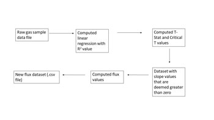

# Determine nitrous oxide flux from sorghum cropping systems in the Great Plains

## Background and Rationale

Nitrous oxide (N2O) emissions from grain sorghum has recently been identified as a critical research gap that is limiting the life cycle assessment (LCA) for grain sorghum. The goal of an LCA is to assess the environmental impacts associated with all the stages a products life. Recent changes in the life cycle assessment of corn has resulted in grain sorghum appearing to be less favorable to corn for biofuel production.

Study sites have been established in Colby, KS and Goodwell, OK to quantify nitrous oxide emissions from fields/plots planted with grain sorghum. Nitrous oxide emissions will be measured by a vented chamber technique. Chambers will be installed directly after fertilization. Emissions are measured by covering the chamber with a lid and immediately collecting the ‘Time zero’ headspace sample. Three additional headspace samples are collected at 15 minute increments (0 min, 15 min, 30 min, and 45 min).

The gas samples collected for 2018 have already been analyzed and the calculations performed in Excel.  The raw gas data is imported in one long column. It takes a lot of time to then organize the data in Excel into columns. After organizing the raw data, then it takes time to run the calculations. The whole process is time consuming and is a multi-step process. The rationale behind creating this code is to streamline the process resulting in time-saving and minimize human error. A large volume of gas samples will be generated over the course of the project.

## Objectives

The primary objectives of this coding project are to:

- Import a large data stream of N2O gas sample measurements
- Calculate daily and cumulative N2O flux

Necessary steps needed to accomplish the objectives include:

- Perform a linear regression analysis for each sampling event
- Calculated r-squared, critical T, and T-stat values
- Compare T values to assess if slope is different from zero
- Replace any flux values that are not different from zero with zero

## Outcomes

The desired outcomes for this proposed code are:

- Successful import of gas sample measurements
- Linear regression calculations over a time series to estimate daily and cumulative N2O flux with an r-squared value
- Replace slope measurements that are not different from zero with zero (no negative or slightly positve slopes)

## Sketch




```python

```
