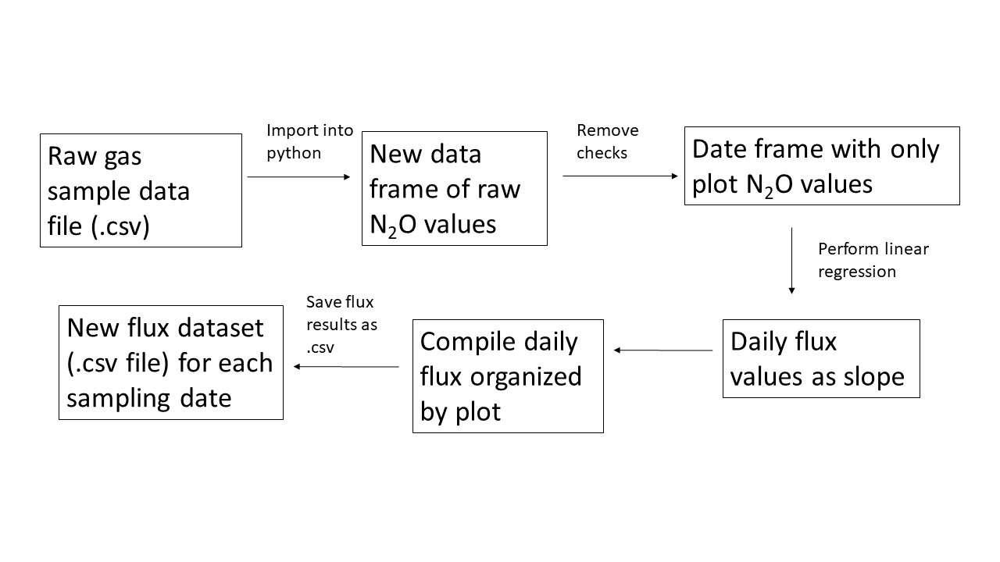

# Determine N2O Flux from Sorghum Cropping Systems in the Great Plains
---
**Author**: Kathy Gehl  
**Semester**: Spring 2019  

## Objective
---
Create a Python code to organize N2O gas measurements from a gas chromotograph and calculate daily N2O flux values.

- **Necessary steps to get started**
   - Clone this respository to gain access to data sets folder and Python code.
       * A sample dataset of N2O gas measurements is located in the Datasets folder as **Sample_data_set2.csv**
       * The Python code is detailed in a JupyterLab notebook called **N2Oproject_final** in the main repository.
   - Import raw .csv output files from gas chromotograph (N2O data). File needs to be a .csv and placed in the Datasets folder.
   

- **The final code will:**
    - Organize the N2O data into a workable Pandas dataframe.
       - The format of the Sample ID is: 2018\06\COLBY_304_T4562218.DATA
       - Users with different Sample ID format may not be able to use the code without revising.
    - Calculate daily N2O flux for each plot at each sampling event
        * Flux will be calculated as slope using linear regression with the time sequence as the x variable and N2O values as the y variable.
        * Users will need to change the time sequence if it differs from 0, 15, 30, and 45 minutes. This can be done in the code when setting up the variables.

## Motivation
---

* **Background and Rationale**

    - Study sites have been established in Colby, KS and Goodwell, OK to quantify N2O emissions from fields/plots planted to grain sorghum. This project generates a large amount of N2O gas measurements over the growing season.
    - Each sampling event is sampled over a time sequence of 0, 15, 30, and 45 minutes. Measured N2O concentrations are linearly regressed against the time sequence and the slope is considered the N2O flux for that plot on each sampling date. Linear extrapolation is used to estimate flux between sampling points and then season-long emissions are estimated.
    - We currently have been performing these calculations in Excel, but having a code in place would streamline the process and would help reduce human errors from copying, pasting, and deleting within the spreadsheet.
    

 
## Outcomes
---

The desired outcomes for this proposed code are:

- Successful import of gas sample measurements
- Removal of data values not needed (check samples)
- Linear regression calculations for each plot over a time series to estimate daily N2O flux as slope.

## Sketch

